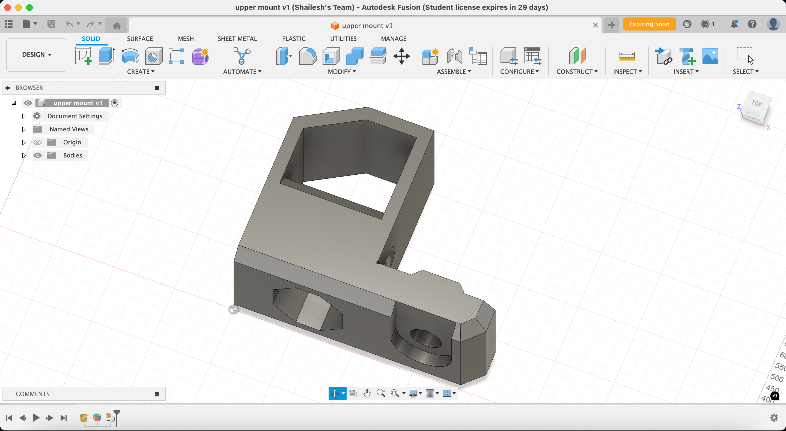

# June 11, 2025

I'm quite not exactly a "pro" at CAD modeling only 3d printed project I've done so far is a rover with a friend, so well naturally I have started with making the simplest and basic parts needed for the printer from scratch using Fusion360 (and yt) and the frame will be made using 2040 V-slot aluminum similar to a Bear Upgrade.

Also I am either redesigning the parts from scratch or if im using smth that already exists I am still making it from scratch cuz I'm still learning CAD and I'm not exceptionally good at it. I will be using the [Prusa i3 MK3S+](https://www.printables.com/model/57217-i3-mk3s-printable-parts) as a reference for the parts and their dimensions. I am not going to use the Prusa i3 Mini Rambo and display stuff so naturally those stuff will not be included.

I am also planning to use Fullcontrol with Klipper firmware with a Raspberry Pi for the 4th axis control and support as Marlin doesn't natively support >3-axis control.

- [z-axis leadscrew cap](https://a360.co/3HE5PBH)

- [z-axis end caps](https://a360.co/4dXiFXP)

- [y-axis end caps](https://a360.co/45oOS8p)

- [z-axis top](https://a360.co/43T0UEn)

A Prusa i3 uses a Mini Rambo control board, however since I have an additional axis and an extra stepper motor for the 4th axis, I will be using a Duet3D Mini 5+ board for the printer as it allows for more motors to be controlled, and a Duet 3 Mini 2+ expansion board for an additional 2 stepper motor drivers. The boards are quite expensive 😭 but welp needed for the 4-axis mod. I also plan on getting a Raspberry Pi with a Display and camera for octoprint but we'll see about that later, depending on my BOM.

**Total time spent: 5-6h**

# June 12, 2025

I have made some more parts today, I'm still not sure about the design of the z-axis top part, I might change it later. I'm working on the PSU mount and cable clips today. I had a few ideas on the mounting of the Duet3D Mini 5+ board and the Duet 3 Mini 2+ expansion board with a raspberry pi and a display, I might make a custom mount for them later.

These are the parts I made today:

- [psu upper mount](https://a360.co/4jLz3fi)

- [psu lower mount](https://a360.co/3HT5qLH)

- [cable horizontal clip](https://a360.co/4600grg)

- [cable vertical clip](https://a360.co/4e1TbZw)

oh and restructured the folder structure of the project to make it easier to navigate and find parts. I need to export step files too, will prolly do it tmrw.

**Total time spent: 3-4ish hours**

# June 18, 2025

I've been gone for long cuz of exams and have a study holiday today so time to grind despite having chem tmrw welp. so im going to try to finish all the y-axis stuff cuz there's a lot honestly and i've only done the end caps. I also found an alternate for the duet board, the Fly‑E3‑Pro V3 but still researching on it cuz it seems too good to be true as it has support for 5 motors w/o any extension boards. I've already been thinking of my second project before completing my first 😭 but idk if i'll be able to make all of them so frustrating.

I forgot most of the fusion shortcuts and stuff cuz of the gap-
ahhhh im spending sm time trying to figure how im going to do what i want to do
i have a backlog on the z-axis stuff to be exported to stl and step files, i'll do that tmrw or later idk
its SO HARD to make curved parts like wtf or im js dumb probably just the second one
idk how im going to make this work im js building stuff based on what i think i need and how the prusa works and stuff ppl have made for it on printables 
someone genuinely needs to find a plugin to export into multiple formats and locations at once
i think im done w z-axis and y-axis for a while now hopefully (foreshadowing maybe?)

anyways here's the stuff i crafted tdy:

- [y-axis belt holder](https://a360.co/3SXdeyr)

- [y-axis tensioner](https://a360.co/4ldDb9c)

- [y-axis motor mount](https://a360.co/3FHImza)

- [y-axis rod holder](https://a360.co/3HMG16q)

- [y-axis mount](https://a360.co/43Ntb0r)

- [z-axis motor mount](https://a360.co/3HNQtec)

**Total time spent: honestly no idea like maybe 6-7 hours**