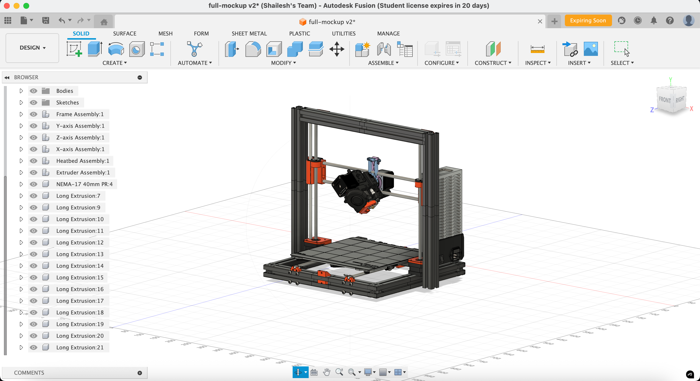

## 📌 project description

axon is a custom-designed 4-axis 3d printer inspired by the prusa i3 and bear upgrade designs. it features a 2040 aluminum extrusion frame, custom cad-modeled parts, and an additional axis for extended functionality and experimental motion control. the printer will be controlled by a btt octopus v1.1 mainboard running klipper firmware.

## 💡 why i made this project

i am building this printer to gain hands-on experience with cad, firmware, and 3d printer architecture. the goal is not only to assemble a machine but to understand and customize every component from the ground up.

## 🧩 full 3d model screenshot

## 💵 bom

this is the bill of materials (bom) for the axon project from where i plan on sourcing stuff from:

| Part Name                                                                                   | Quantity | Unit Price (USD) | Total Price (USD) | Link                                                                                                                                                       |
|---------------------------------------------------------------------------------------------|----------|------------------|-------------------|------------------------------------------------------------------------------------------------------------------------------------------------------------|
| INVENTO 12V 30A 360W DC Power Supply SMPS AC to DC Converter                              | 1        | $20.91            | $20.91             | [Amazon](https://www.amazon.in/Invento-INVNT_49-Supply-Robotics-Projects/dp/B01LZBJIKX?crid=EWOS8DW1NNHE&dib=eyJ2IjoiMSJ9._7FGp592J_cJx3CXcsvKto63wxgqTUg3L8AKxW5PgcAXeuuTAeUHnNRqrhEptPwo3NbumUQ81UDNANRuDePxcEjsXJmPUHUv_67JpHwOnsToaK4-vd5WxucCtY1kC2R4ctfPQsxAXK6FSoEoTs37i1kujcggLiasGDvKxIiJQZIXMsRFPMPiWd0JHQrMFWslo3Q6Q5vas0Rt9Pfhov9gjDuZ5AxEIngUsundT7YeYsc.WzegyBNUbT_Jvv5l0ruGrx-iZG4v317PEas6yWe2vJI&dib_tag=se&keywords=12v+30a+power+supply+with+cable&qid=1750574454&sprefix=12v+30a+power+supply+with+cab%2Caps%2C323&sr=8-8) |
| 12 Pieces - LM8UU 8mm Linear Ball Bearing for 3D Printer RepRap Prusa CNC Parts            | 12       | $7.40             | $7.40              | [Amazon](https://www.amazon.in/12-Pieces-Linear-Bearing-Printer/dp/B07PJDCKM1?crid=2MBCHX09SRCF2&dib=eyJ2IjoiMSJ9.eZfEeRnEjaOmheJLZ4X04Wx4fC0a2Yu-z5QO44Y603SLS5J0yrrE4jJKoGcmNKUWB9tCwBeZ3mI7tG6xIEvo9a1USAI_IJ8Hxexuys6vjzW2LLsPJqAR0i1LxOVzxmFp_ilBpQNQbazt4-tTXjMm2fj6XmbBSxljTndCEXeHmV-m9AD4bR1qbXzvHwe7PpWOI7ThbtSn2iN9NilTYaN-jR265ozn0wvbImWoT1ACZWWvYZ6NyVwnnsi5ZuWB6rIrUYZRqsm6TfHEYDDR2_OI0bRJgmGBErK51XQwyl9Kpz0.xKlQTi9Zs9NrO5WcvhVRUuxybBP3szBtwcJSSut5qOo&dib_tag=se&keywords=LM8UU+bearings+10+pieces&qid=1750573162&sprefix=lm8uu+bearings+10+piece%2Caps%2C237&sr=8-5) |
| (10 pc) FlyRobo 16 Tooth 3mm Bore GT2 Timing Idler Aluminum Pulley for 6mm Belt            | 10       | $10.84            | $10.84             | [Amazon](https://www.amazon.in/FlyRobo-Tooth-Timing-Aluminum-Pulley/dp/B0DDPLJGN4?crid=3TXN95BNR3XO8&dib=eyJ2IjoiMSJ9.ZJhNNn9mG0yYN0pdNFcSC_7I6qbdgBQVjgHelVX6PWYc7mfdKre_eXmaPmYreUfxzMdrQdABC-VBZDTq33FFWUyyXepEPB0w3eSoJdPYB_nXcFmxUzibduRXp1bma4xuAJRGNEXKWO6pwwKv85FpeiUq3BMIT2tTM-JA2l_DRU2xQ8r5GY2jXpfbCuYOq8fGqYxwuw9Jua2CHRoN7dJM2trxWCSKp84PQZARB21B7dIT3LjizdH1YZ4dhvJlDNcW-FMc9-JzmVPbfTwKsG0dwDXnSCVyofRFo7_5bvDmm6Y.7iYhMI3qZl7d1USAA83qUJ-vTV2IhmavRYGoLlBRuH4&dib_tag=se&keywords=GT2+16T+idler+pulley+with+3mm+bore&qid=1750573224&sprefix=gt2+16t+idler+pulley+with+3mm+bore%2Caps%2C254&sr=8-2) |
| Robodo PR38 Optical Endstop Switch for 3D Printers (RAMPS 1.4 Compatible)                  | 2        | $1.79             | $3.58              | [Amazon](https://www.amazon.in/Robodo-Electronics-PR38-Optical-Printers/dp/B0787G4MYT?crid=1BM89RJOUV1MT&dib=eyJ2IjoiMSJ9.5Z2eyzQFKsxuAe02WBXRLwL2TQo58kUyUOFIi5G5CDmwTPCropZ4z6IR65hAU1FCMBDFETLuGyclimyFfXWFWlYA1ZRFZNbatbffCciYoBo743T9RyegpEFDytn8kYkTqKs9UOvCsvMb3495DbgSI1qS41ToVQtkx-xRShJj3HTAxSEwRtKj-ZAOczzeU75cw3H1rGtOGy_974FylIEotoFzS5gz5DjYm-oxN-q6N48PGdf0uzIOk1GRlmWQoFBNTdawJAfHSNC8MdJUDngDfeCMiehz-AV1zCl1lPvZK5s.KmW6ayjSjA2ziIkSAwU4gJOJ5OV3k52i9GuNJ319AKM&dib_tag=se&keywords=Endstop+Switches&qid=1750573717&sprefix=flexible+coupler+5x5mm%2Caps%2C772&sr=8-1) |
| Robodo PR64 Aluminium Flexible Shaft Coupling 5mm x 5mm for CNC Motors                     | 2        | $1.69             | $3.38              | [Amazon](https://www.amazon.in/Robodo-Electronics-PR64-Aluminium-Flexible/dp/B0787JNN4R?crid=2TDHKQ2XNNTD4&dib=eyJ2IjoiMSJ9.jDBiMNNkWn0zt4FVrV3lHJt_Tp4ha3HncpAnDBQdg2wCRJqISWfXATjjBMY9Azm85b540Xf-XB5PphKGmeMKF8992PuGexzokGcdsqsvus6ONtxl5KKDaijyNwZIsQcqVCE3eu9QAc0jI6P26SWzGvYUUyUISmQxXarSJ94ykcfCt2_0CfjAulTc43PAgVDi_hXk5IhskgmNlTNEDw9dBGu6Quc5_xAoET4HOQ4mRH0VtVZoSpwZ8gjm2VX05N79QDe6wxQCVW-GnEgMOSWFIHGqi1CCDC3rVB0EiKfGPPw.TPxRTCWqree-FNbknxgfW0xBB0gd4OgfQimCraJhNQo&dib_tag=se&keywords=Flexible+coupler+5x5mm&qid=1750573540&sprefix=flexible+coupler+5x5mm%2Caps%2C337&sr=8-4) |
| GT2 16T Pulley, 5mm Bore for 10mm Belt (Pack of 2)                                          | 2        | $3.31             | $3.31              | [Amazon](https://www.amazon.in/Tesseract-Timing-Aluminum-Pulley-Quantity/dp/B08QMFK9B1?crid=1RVBAUKD4S9QE&dib=eyJ2IjoiMSJ9.CMd4G1Kggo4tFHat8upJ3blsUI07j5Wa75g5k23Ob5E-D5ru7ECA1Koo0CHVKMicF7x4s-BwMCtqR8tWk81xjMrhrSkMoQTdyvziUOY1Uw2Dc5iE_7aX3We8utCtNNHHfw5wkDtWXhbwBRKZgTJKeI3Yxbv111mKWwBNBy_Gil3sElHkr-KuekhI_CBB9lLSwnaxnIXI6xLhd8OSU_mjh5-d-ZWiMh_iTJzjtJztPD5NfMTrKAJGWfQz1VFhxeA8XTnUYOTT3TneDrC85UWyFp4Wq5TQlPY0yuMM_uIa738.X_xQGiFopTo2jfTib4p7elIHclINNrcI9kGFHoShm98&dib_tag=se&keywords=GT2%2B16T%2BPulley%2C%2B5mm%2Bbore&qid=1750573494&sprefix=smooth%2Brods%2B8mm%2B%2Caps%2C581&sr=8-1&th=1) |
| MK3 Heatbed Heated Bed 214x214x3mm Aluminum PCB 12V/24V Dual Power                         | 1    | $12.03            | $12.03             | [Amazon](https://www.amazon.in/3DINNOVATIONS-Heatbed-214x214x3mm-Aluminum-Printer/dp/B0934N2CCD?crid=14KOVGSBTNF9&dib=eyJ2IjoiMSJ9.jxBfxM1ak4yeKNLOUWPvRQ-V0M3GZ3Y0UB1t2ykF1SdaEGuEE8Lq-RBzWoyWKOpsL-Zt2G351rC-X-Op3OZS1l406ws5l6oRUBWLeO4XqdPzVOBkqQLc9bmlzQecfNb1nnt3Fg8MAgpGARg5y1H9VkwM6jz9GReI39fNl7aOZof0vVmQTJiThXKh9SrH-SMsFbW6xv92-EnStVi48MfLQnyfzBiN7yH-R1KqBQXrGZ2eyEmP-7En8JnLYd49dBXWkFI_cBNciCr1C2y3aAzv_JpqUkzeSJ-VGIG_ZN0JyI8.k_2pbaloEAtJhgBZBkaaiGxwkXVi2DWCXMLnOOR3h9M&dib_tag=se&keywords=12V+Heated+bed+%283mm+thickness%29&qid=1750573747&sprefix=endstop+switches%2Caps%2C383&sr=8-1) |
| Robocraze 100K ohm NTC 3950 Thermistor with Teflon Wiring for 3D Printer                  | 1        | $2.40             | $2.40              | [Amazon](https://www.amazon.in/RoboCraze-Thermistor-Temperature-Pre-Wired-Insulated/dp/B07N1FNNRH?crid=EAZ4JYHO85VR&dib=eyJ2IjoiMSJ9.51ldN5r2Wf9-Zlbn49y92IHFmiKkuiWHFoIbqpZ5G0QQE-FsaRAO172dJfRUvB99jlDuF9_j1yLRUG6rg3iwk2z5oLFBjlu7mCC8h4F498zmZei-qPe3Z43S10tX2uxaezIYsGE8vmUH8831pM35kx_5LkEDWshGstxL9pDMMlYuLr8Xis_nqwiq7xET50VGfQ9WKe2514OnSeP6mwBwRE44QFevpYMfQ34oruagI5su1ZG3h5onOPoWwePK2t4kkMiLXRlW5UsXHDRUmD9FzJAkfEZauVcjrpAny36jU4M.2xckCbHHm3RPUx2-UVAqLgQjHGt2aEZjQXb76fc19Dg&dib_tag=se&keywords=100K+BTC+thermistor&qid=1750573780&sprefix=12v+heated+bed+3mm+thickness+%2Caps%2C386&sr=8-2) |
| V6 3D Printer J-head Hotend with Single Cooling Fan for 1.75mm Direct Extruder            | 1    | $9.63             | $9.63              | [Amazon](https://www.amazon.in/3D-Innovations-CHPSS531-Filament-Extruder/dp/B06XXX95PC?dib=eyJ2IjoiMSJ9.sWi6RFHD90SbBl_Fk9ShUQDgYHE21wqMjRLdepyVcRk04wLPyQVcECV9rg8wCNN0DdACXRAMPhh5JsP-G7KLEBC3edvHWkEbF-sVxAFLKSbKf-3lmdkP-IfspdXur61YeiA3UqRMrGlD_UM6ZlDbQ4hob2qvZyK_YgRIZcZ1_uOZnOb4Gxr0AFB7GJ9I8Cvxxnv8eJPgVcRU-dGZP_17yjX7mkvkX8sLmNX0oXycteiWnbM3xInlWxAefS-B1sShnvzDeYk3N99hrQrpgysfS93s5FzQABwMOLqerW45-c4.fi3uUb_eA8H-IifrWzBuFHFbZZffWsuYgL6piI5v9BQ&dib_tag=se&keywords=E3D%2Bv6%2Bwith%2Bfan%2Band%2Bthermistor&qid=1750574759&sr=8-1&th=1) |
| CALANDIS Feedstock Extruder Wheel Hobbed Drive Gear for 3D Printer                       | 1        | $4.00             | $4.00              | [Amazon](https://www.amazon.in/CALANDISTM-Feedstock-Extruder-Parts-Accessories/dp/B0F7HMT78D?crid=29G044DJWMZ3&dib=eyJ2IjoiMSJ9.n0lqD_ztvGzVDeqG57tOhx2lgtLs4H6EZ-Bq0MWzXoGScod6-uoyJwCdUBCAkvTamp4wOSjmLDm1Fp3BFsclPeneTavo-AkOu1yJrODct1f4xJo46_z_rH0dK8NTwvcV_M00x2hMgxWCdjZN-DgO0g.7W13Sy908_rYlzdOx5ryEI7OFnh5P7Vh9p-Tc72Jg1A&dib_tag=se&keywords=Hobbed+gear&qid=1750574801&sprefix=hobbed+gear%2Caps%2C250&sr=8-2) |
| 625zz Double Shielded Ball Bearings (5mm x 16mm x 5mm), Pack of 4                          | 4        | $2.37             | $2.37              | [Amazon](https://www.amazon.in/Bearings-Shielded-Miniature-Robotics-Projects/dp/B09VCFDNMW?crid=1IKCU2WPNP6F5&dib=eyJ2IjoiMSJ9.5glCZnDClNk0WQTEsb9ttqX_lf3fuWjGr-NSSJzonlmQJa0MrwReX0mQkmrBlowljVeGD-ZivFESBasgW3mJOJFC4T34qZIhypwitpadc3cwMQLhNmH_EImcNnLw7gF6qyMF46S9FaqfcM9Dm2zOuJ2ERNSwVrhCy6qlvoprARr2-d0Fmj60Mh4BYnoR2UkhsPEUSx8iqGjnSkB3RdFPII5j0SerfgK0ao3Ak_GK9_l1CrvwkFFbwTXuFQnvRep3-J4l-1exPOADv3wPjGlLArSVucjHI68QbNup2zWhbIg.5y7E3YVr8D6Hor7_UWG8KSK6BUi3yfQSPsFqLHs4Ghg&dib_tag=se&keywords=625%2BBearing&qid=1750574842&sprefix=hobbed%2Bgear%2Caps%2C281&sr=8-6&th=1) |
| Compression Spring 16mm OD, 50mm Length, 1.2mm Wire, Pack of 2                            | 2    | $2.37             | $2.37              | [Amazon](https://www.amazon.in/MMTool-PRODUCTS%C2%AE-Compression-Spring-Diameter/dp/B0D1127D3W?crid=38C3Q3T88WTE1&dib=eyJ2IjoiMSJ9.XgEZ4kaJP5-RsTaFDWs79fmi2G5f_NChGS3cwgEVq2U8I_iQEkegEA6dnPw9ZNM_9w2VhwrgAHaWy4Q-tvwxqd5xWlTBoZcLjN0Nrq5iooUuvx_G6ukE9hpcvTGejs9OjtycSAJ-dCR7Pf7K-337izqSrLIyNIMIpWerWzpuMBWUX4howWHecxV2jH6p7uQnV5Rq45WtKcRJnImYHrNBNAcsnUUFhJkScBPgaJ8HLe8idK1_gYaFmgWZh8e2Yu0cHBxBVwyGbgbdfMMWDLilREOM2880Yn8AXyZhmzWonIo.fT6NI-KoBsYf2EgxYQuIja_2oBsCDDvFDVStzy7D5pg&dib_tag=se&keywords=1.2mm+extruder+springs&qid=1750574929&sprefix=1.2mm+extruder+springs%2Caps%2C213&sr=8-3) |
| PTFE Tube OD 4mm ID 2mm, 1 Meter for 1.75mm Filament (Bowden V5/V6)                      | 1        | $6.01             | $6.01              | [Amazon](https://www.amazon.in/RITEDEAL-Extruder-Filament-Transparent-Printers/dp/B082XHSYG9?crid=1DAFILZIFDI4C&dib=eyJ2IjoiMSJ9.tkCgQ_Zqiq_B-UQ67NAV6jUk8x4B_8UzamgMBpX32wT9xbbhkeWktWksJZ0LfGIkN1OdLSh1HR30fMpc7ZNjxb_8CksS5BjyI4ZQkXuYbcgujQZu7INrN708q3JZCzpkJ3RSudx2EKAubk7ufl5W6WAF4sGSi8xw-oACSUegI8HF2KFJ9unsBbdfBJoZGfc5PSFpJPKeiMz45OFkT0gtANgmweqrhB8IN_ZS4_rqYlODTjlgaGGR_AlzXKEDdGi7As2pDTCeiVKCOmPAemnMonKLrFkO7I0ZGiG0Pt5j1KY.C4TBNRCUneZUseTPf04akVnYeHfezwr16Rfa2oI8zM0&dib_tag=se&keywords=Bowden+tube+4mm&qid=1750574956&sprefix=bowden+tube+4mm%2Caps%2C252&sr=8-2) |
| 12V Cooling Cabinet Fan 50x50x10mm, 5000 RPM                                               | 1        | $2.05             | $2.05              | [Amazon](https://www.amazon.in/DHRUVPRO-Cooling-Cabinet-50X50X10-MM-5000-RPM/dp/B0BTMDBHX1?crid=3HFJ4ZARYCUJE&dib=eyJ2IjoiMSJ9.E_eFBNLlvBOewQFRMOM__CAN-fvFr4IUlHWdK0wqMbtVEENMn9mzDIBnjoyG-V81JrZv3r1u1m2tM9YrWCSWJ1c9AVR5E7Qn1gDHjN8CETwStRTIYpw75xJ8LWTpemriM4mx7JfhWuaz4sx9RBdnOIVWKtRvUBGZpbgYDJWSRZiMNYPiw_bJuS9cPscCKJ9UcL0h9E2kqzLUDVadSzfN2yTpG4ZG1fN2XyJhr0KZGFQ.gf1XsSDnpH63vxcsLpN5ierHop8VvpCB-wUzhgBwLUQ&dib_tag=se&keywords=12v%2BRadial%2BFan%2B%3A%2B50mm&qid=1750575003&sprefix=bowden%2Btube%2B4mm%2Caps%2C208&sr=8-3&th=1) |
| Heated Bed Power Module High Current 210A MOSFET Upgrade for RAMPS 1.4                   | 1        | $2.90             | $2.90              | [Amazon](https://www.amazon.in/xcluma-Printer-Heated-Current-Upgrade/dp/B085WW4FS9?crid=2NW36NYVJ1972&dib=eyJ2IjoiMSJ9.sFfdUPK5TVmO9Zf3_GROUVDbIV5CnF004KwbYdtUfbiCdpNOGd2aOjy5lR8BtXK6-oNI1nVHIolqT6M8Dacf75dGZ9Oq1DVF-kDy4mCilx0K8ldSEbb-8YjleOGVTsixVghifuwV0JgwIQgJOMyLe1earImP9b5kqV8RCm8xUtdD7bjv1L4oWka-FQWJXuh9D3FR-gp-Qu0hu92ED5ukV4yrEKa-yxMxOiUgy1TVoC3E9OYsuU_WISt-Pma-mX-nwr93Ro9D3sc2yjJz-pqf-lePLQ0JN4iQCOyWU1g0svE.6NIuqvy3F8D5vqCw3sMen7YRDd2inAr1lXNjhsIiuNg&dib_tag=se&keywords=Mosfet+board+for+the+heater+bed&qid=1750575041&sprefix=12v+radial+fan+50mm%2Caps%2C205&sr=8-1) |
| GT2 Open Timing Belt, 6mm Width, 1 Meter (x4)                                            | 4        | $1.99             | $7.96              | [Amazon](https://www.amazon.in/Robodo-Electronics-PR60-Timing-Printer/dp/B07881N24Q?crid=3NEX5DHWRZ6A&dib=eyJ2IjoiMSJ9.qTH6Yhm2SWRwf2D64FvtRebXaCt_j6ECPYj2bGEB8Pc52osUh1R3rdpjWWFRZweSgfoyuBgiDeCTzi6S37Z54i6nCs5wgRNbL9-uWsihZcWgu79lI4LT9ZYfyDm6pqiU1FOOMLTIBsdJ4DG9cwgtRUnYHh37u89Gx5FRM6fabb4RAjQUo9KkWlTIK9i85inNXNH9YY3A0VJx00fJ-vDLLNrMHYBnX_S0HVEEhlnftzW_77h60dmBC2ZEsCvrgQHehWiZ3KhpOTUNdymx2nkmJunQCiYHRmOgQ_itm518kk8.1slp-lfxPXqU6H3mQfZfJnPLTb8NbdhGrfKbVgzzDPM&dib_tag=se&keywords=GT2+6mm+belt&qid=1750575787&sprefix=gt2+6mm+belt%2Caps%2C277&sr=8-1) |
| 8mm Chrome‑plated Smooth Rod, 500mm Length                                               | 6        | $6.02             | $36.12             | [Novo3D](https://novo3d.in/8mm-smooth-rod/) |
| SS304 Stainless Steel Threaded Rod M10, 600mm (Pack of 2)                               | 6        | $9.22             | $27.66             | [Amazon](https://www.amazon.in/INVENTO-Rustproof-Stainless-Threaded-Robotics/dp/B07SH84F2Z?crid=23JBBII2TRYLY&dib=eyJ2IjoiMSJ9.XzUbWvSGD2_Xq3hRDjH6ZnC7bS1hdcc0ow0DoJaioSzdqIteyTuL04QVbS99WCzAdbt8emJGARpjvihGbPrz242Bte_096s8qnkaYh0Jl_9auFuHza_dk6aTesDFYa4dnTm9JDt9Y_auO5docKYzmiVgvkL7PpR-dnceT9A8S7v--S6boHxOIzyt7vYmukLTAQg21LSwCbIfiKRfTMjlEycLd8Q0WJCSQNOEI4DNtoFWA_zGZWJ09j8EKnuaQM1UgAmMLOe3dD-4pGS2oV6RJqeHFhnXTGo4CQ5HV9Dbs08.PWZazGXJSLKkBKwbgtA-SiouTKGh8zlfSgnA2XaU7C8&dib_tag=se&keywords=M10+threaded+rod&qid=1750575958&sprefix=m10+threaded+rod%2Caps%2C257&sr=8-5) |
| M10 Flat Washer, Zinc Plated (Pack of 50)                                                | 50       | $3.12             | $3.12              | [Amazon](https://www.amazon.in/TheMujtaba-Suitable-Factories-Kitchens-Construction/dp/B0CGF676L3?crid=1JHSD8XO8Q1FA&dib=eyJ2IjoiMSJ9.rhCwvm3PRoo_TKmPH-5Gozp2XiuehJFdfGA0TNyvobQ29UEeK-q91oRl8ouk93k_zZ1E_HV-BZKMBH7cBGYzF0jzo6SuguMmgjYdX09X0TOhuciPHzSI2gGdgJ4jdlFKycjSdWNUvTMBrOZG_jxJb9I8l_Tuml5_6DhROmcvZxBXzfW3gaSQwrGnxYYciuCTJEU0ZFtak0s69cxLPeDUDBvxs2se5BvYgwGxGL3_d555rb7Mp7ll6raGiZG9-IwLBZh7DBohh3CS1q1BSnmRSBNJL_0U-cvmppfD1VQ0LMo.82XYjsgpwAlTl3j50p4RamfzraJpf5lfFfnebMVJarw&dib_tag=se&keywords=M10%2BWashers&qid=1750576013&sprefix=m10%2Bwashers%2Caps%2C264&sr=8-5&th=1) |
| M3 Flat Washer, Zinc Plated (Pack of 25)                                                 | 25       | $1.13             | $1.13              | [Amazon](https://www.amazon.in/Rpi-shop-Washer-Plated-Quantity/dp/B0813KBJMZ?crid=27ZRAXZZDAZE4&dib=eyJ2IjoiMSJ9.d9pCKgBEQiXAqFqdlIVboLkdzsDWklw5I7P8wgfW_ZCQzFOdLH7YEvY0zyxMxTaD1U5PCeS8Pnk2v-G8_TChQlW5r-HhLSAxdZmGUuRZ6oR85imADt6auR8wnJRYIVVKCPUBBJCT3eisN6QntrVPCdtiQcws67_gBJ8AihnhCYLgOF6hcmnKafbWh4XvrYCC2TJ4iMlLh5bxU56Y__38Bs1vFx6VB4sB71qGDodZ8ACVPaEUCYvKcUitNTSGCecc6TEm56kHV2acC5pZttZSwKb8wM8JqClxVEdxSz7hPeg.hYhUQdZMr6FD9jHNDX2PTOyIDJfNe6TjSDr7QVZvF8U&dib_tag=se&keywords=M3%2Bwashers&qid=1750576330&sprefix=m3%2Bwashers%2Caps%2C255&sr=8-6&th=1) |
| M3 x 10mm Stainless Steel Socket Head Cap Screws (Pack of 10), 2 Packs                 | 20       | $1.58             | $3.16              | [Amazon](https://www.amazon.in/Rpi-shop-Stainless-Machine-Quantity/dp/B08CKXXKWP?crid=1VQSLLKNIK0JZ&dib=eyJ2IjoiMSJ9.9vF0-x_khIWZsLAIf8n-kyWrP98AEYHFc-c8IfyygG7UTufPnCUk9ovF2o7Ig_0spCLRclFuHYtm8C36NiLkYjQuiCKX6QojCr485PHrAfohgER9OArDAARulzbN7D3wH9yIa9hzHz2dmlV-zUSuA7PcO9NyvuSISe1M4z1kwSAnwUkamOo36v_WjYKGQWWZ3zRqI82ZOd4oOrYWX8yBZhGubcRsO7o0o4lW81IvBIhwk5C_9U_2hIxH8Pse4eRD1vNIPi1KdfEtyyow3tdmRAzh9LoiSsxX-F7sFdi0sbQ.0QlvBsnjMn0kPemTWRVl3mbZrg_9D3QB8-oe8mzNkic&dib_tag=se&keywords=M3x10%2Brpi%2Bshop%2Bcap-head%2Bscrew&qid=1750577556&sprefix=m3x10%2Brpi%2Bshop%2Bcap-head%2Bscrew%2Caps%2C209&sr=8-4&th=1) |
| M3x10mm Allen Button Head Cap Screws, Black Finish, High Tensile (Pack of 25)           | 25       | $3.00             | $3.00              | [Amazon](https://www.amazon.in/NUNHATIA-Pcs-25-Button-Tensile-Bright/dp/B0BG64N8HQ?crid=FXD27YNYNCBS&dib=eyJ2IjoiMSJ9.QwNjm7nSmryNEK-o2EmM66g1s0uxhJP1stP11f-7NgMWIoh7pcVL4S5Yf3ecOxjB-sDD-PWGnWNSpirsTSiMz2bHh3gBsEPzVQt_xOwI6-sJ1E2taFWhiiwrugfFYzRU5ajNF_tLCjUIBxs_BzxkORl3u2MXStj7A5AlyDsbYdm85cEpajtSEWSvbXpaNVh6fj430OEb4EEk15ExazubspTbQpG2xrs7KYzww8Bq3Yt3267APzBzxQSOVFixnfndywsGmoy-n6Wex6ATL0c1ySKH9BC50sLiGZR5jRaHviM.8R17lTEtfdc8LdwMSyLaynTwmIAbg7boKQFQ2eX_PoI&dib_tag=se&keywords=M3x10+cap-head+screw&qid=1750577387&sprefix=m3x10+cap-head+screw%2Caps%2C281&sr=8-3) |
| 360pcs Stainless Steel Flat/Fender Washer Assortment Kit (M2 to M10, 9 Sizes)           | 360      | $6.55             | $6.55              | [Amazon](https://www.amazon.in/Serplex%C2%AE-Stainless-Assortment-Assorted-Factories/dp/B0CL48J9XZ?crid=X0I6AXBECK9M&dib=eyJ2IjoiMSJ9.Xz9PDgrZE404C9wLWngccvluz9OmAzQYFneCIq0y6GlsFFkL1WwSqmOal3Vl6iSJUcrRocQ6ZNThg56F2ovp-AcJjjjVqnUqwt3JvG2igQsoKpLJGGth8cZRVX-Llfk2RYIFeamjCRqP712pRd6pTRbBfVRb-YdHuEnOl_3zeLXIyvbe-_k_D7ZtbNU7Sg43UfyaqaMCT7M2Rh8WoNNIYEx6gQFyJdmQeTzjJjzqhTMPNPaZ8kaqzNb8ET2dhz2ZIcOICP12EhvLQyvM-PSjJyALcOPVDX2wH8-1Qr9Sfgw.TVrngEN-3pPS50mCm40EKx_T7DgkltiE4QhkTb2ZbAY&dib_tag=se&keywords=M10+Fender+Washers&qid=1750576049&sprefix=m10+fender+washers%2Caps%2C264&sr=8-4) |
| M10 Stainless Steel Nuts (Pack of 10), 2 Packs                                           | 20       | $3.13             | $6.26              | [Amazon](https://www.amazon.in/Invento-10mm-Stailess-Steel-Projects/dp/B075GTM9MV?crid=2JSTVR8O0ELP0&dib=eyJ2IjoiMSJ9.IQYx-5N_q_o9a5sC329WOhdibF2-yoSLvmmpG-jSHLA_3ka5G4v53nuJsBzzIkXnAM2ItbRFoedED4Yj15aoxtbVOJJGTOaf76zZEoUh3x_l0b0BufHIE3IEoRHXLT3IlgqbUQ8CLnx08GMo2GGB_ehIyORCIq_F6BrT7EK_7mrnyCCQyR0LUbTbQpMsTnqS4lhoqymN-oW_OH8f0v5UcOi6-mwfzGK09rHO9B1tM8TendWYS9OmNOAOEk6QZHlfrA1KHjPEh4Di5mQEwUAkSuHvFMD8DXGwxOCvXPDU-V8.s_509sLwYRGqx9gohAkkzcb7-SChiP2NNgabg21YPzk&dib_tag=se&keywords=M10+Nuts&qid=1750576116&sprefix=m10+fender+washers%2Caps%2C334&sr=8-6) |
| M8 Stainless Steel Nuts (Pack of 10), 3 Packs                                           | 30       | $2.34             | $7.02              | [Amazon](https://www.amazon.in/Invento-Nuts-stailess-Steel-Projects/dp/B075GSYY3W?crid=58YNA485PFKW&dib=eyJ2IjoiMSJ9.LfDlQSa9gxvN1S8t8fppUwWLecnLr4iP5W6Q3AO9Z92dZJKnCR9ucyqyA1J_aY8jVsHtBEI7-hdyolYe9fajU7B5Kz4tkGLBAXFPzsl9Pd2e5osB2btHS871zjuSYX0zXiLVTZWKAkrd4Od5vpMyvX-m9si-aPchb00qkVQXDeoc4VpUj_VkmE6b8RMjcMZ6OryDBQTHmFVY0U_7t9DGaRk6vRiON7Szz1uyMR6n2-uEftiUKUeOjsw_vpa01jU41OGcxsQtx0kb--f14qV9DgDMksveE9q97LB1W3HRa0w.IUcAnv21nWOHr91RzMLRaiYaOylYnn3FyNk9xAv1oXU&dib_tag=se&keywords=M8+nut&qid=1750576223&sprefix=m8+nut%2Caps%2C258&sr=8-5) |
| M8 SS304 Threaded Rod, 300mm Length (2pcs/pack), 5 Packs                               | 10       | $3.49             | $17.45             | [Amazon](https://www.amazon.in/Invento-SS304-Threaded-300mm-0-3mtr/dp/B072JJKZ1F?crid=33PNQ81DCZ5R0&dib=eyJ2IjoiMSJ9.BXN3jXeAanKIildISVqsXZ7ugc3pWkgfSnBtSWQ64Z232VlQ1OYHYFAMy5WdrO18ImRnc7LAsmR5AGBmSuKpdmp80NvpcY36ntogpRRgwa28UDmhK4RYgcVIHq3RYi03U40XjqGgcCeqPlK2nLDhQmk5nwsbLrqr_d8fB6C2DtOANohIPwe0Dch1BxeV5arFtsHYaMOFwLjGqHFW4JpsQFWHdgZL5p3J1jjEb8jwA2EXY6jnsDrOzbBivbMJ3I_RNW5U3xnqJ5cbhYNebDNGilCNQGqKSgdDI94TEP8Wwgc.NmmEIkZU1uoD05Xg_aJw-W4I6rof0JCdZJ_MpB_d8HM&dib_tag=se&keywords=M8+threaded+rod&qid=1750576158&sprefix=m10+nuts%2Caps%2C296&sr=8-1) |
| M5 SS304 Threaded Rod, 300mm Length (2pcs/pack), 2 Packs                               | 4        | $4.22             | $8.44              | [Amazon](https://www.amazon.in/Invento-SS304-Threaded-300mm-0-3mtr/dp/B072M4FJQG?crid=2Q6KL3HAR8SB8&dib=eyJ2IjoiMSJ9.9VZ2GzhmBSb6V0X8ov8vihAtM133tFnnOpxdC2gp0-HkoRz2uPlRaaWLQmonLkHhwnAlWuSBpH8oLYlYua4N2jR9dk_Hf9lJmaMdNXZ0vZHq3xRtMzxAHsy5qC7x77x2fq8pNnOqoio3wORinRn8eOCAhIjZKbzGsWuVIDITwbvzMnqEP6ICOpOKywTrgafaFwr73oNjX4O9rw0eZV3acFyXxGjMjdC_wyP1vjOHSsoFBsrtC6fhPrmIM2rJO1vVtndMZlERMHQ4PLr969QyEcbDkknq_sKQVW4oK8Xxy9M.kNrWa-XjeElVidluA5EwklNYmfc6dDcIho4zhZvSVC8&dib_tag=se&keywords=M5+Threaded+Rod&qid=1750576275&sprefix=m8+nut%2Caps%2C427&sr=8-1) |
| M5 Metric Nuts, White Zinc Plated (Pack of 40)                                           | 40       | $3.55             | $3.55              | [Amazon](https://www.amazon.in/Invento-Metric-Nuts-Plated-Projects/dp/B01LWS0ZF8?crid=ADPKXEN2NM90&dib=eyJ2IjoiMSJ9.R85WiWZN-BotlfOGpdj8HuaZJCYZ8UMjlPb2PAa-44wHUsCzFq2S6CGuvqPYahs43xbU-S3l9L9y3LlHRdLM5yfvVVj7f5TdY3qn8QJUEf9lPVTjxewqSzP8adLyDu4ghV-mP0xdr9hlp9lqQICU79dNyu-ltfZgEfqo-DFoKUfVGzkspYLy3QpjiGWpJF2X4gDOUDlH0atwOGbSruNXNnl-wq-EAkAecDp0q9Tav8GT_kTsVwW7xoVXG53ZUVYxWns7uDzDE5-1OnyUP_uExuwKyJ0Mx2yAsKtciuQarxo.5uIw8l-qh99KxTnZq3mNcklbk2kGAPvhJAupPco9SOY&dib_tag=se&keywords=M5+Nut&qid=1750576303&sprefix=m5+threaded+rod%2Caps%2C297&sr=8-7) |
| M3 Zinc Plated Nuts (Pack of 40), 2 Packs                                               | 80       | $2.77             | $5.54              | [Amazon](https://www.amazon.in/Invento-Nuts-Zinc-Plated-Projects/dp/B073ZB26FN?crid=21LV186IC7TXC&dib=eyJ2IjoiMSJ9.g7BQKOBh0rSARIauR5lYuYnrK9Uo_YpDWDC7imQ6Q2CSuF3vBFVwnw2vGapiJwm9xJhKt1XXtiNB_SH_7W27GZVaIBEQMMIGZXGSjtA1nAZhyTUeR78Zxy7ErumNXaRaPgO_Qrm4MZsR9XrtwGaNrvasB3vRfWXHLyVQ63S7DdqSjIWXqPGc7cyiFGWFB3JblmCK_JQMTJeFDg6-PiWR4c56r17QpdSsOkHodQ5ni9m_Qbm1PCG1ml7lVCjBf6JHbgBIuNTT3PwY27RUyl66HcCT69Dk5GFnhJDjWjtHsBE.9Ozfd51GJIaZ5Sh_SHtgHd20Xk5ED9pk4j4rdIRmmAo&dib_tag=se&keywords=M3+nut&qid=1750576354&sprefix=m3+nut%2Caps%2C267&sr=8-5) |
| M3x10mm Cap-Head Screws                                                                 | 16       | $0.50             | $0.80              | N/A |
| M3x18mm Cap-Head Screws                                                                 | 18       | $0.50             | $0.90              | N/A |
| M3x20mm Cap-Head Screws                                                                 | 7        | $0.50             | $0.35              | N/A |
| M3x30mm Cap-Head Screws                                                                 | 21       | $0.50             | $1.05              | N/A |
| M3x40mm Cap-Head Screws                                                                 | 3        | $0.50             | $0.15              | N/A |
| 2040 V-Slot Aluminum Extrusion (500mm Length)                                           | 8        | $6.00             | $48.00             | N/A |
| 90° L-Bracket for 2020/2040 V-Slot Frame, Steel, Black                                  | 16       | $0.72             | $11.52             | N/A |
| BTT Octopus v1.1 Mainboard | 1 | $60.00 | $60.00 | [Novo3D](https://novo3d.in/bigtreetech-octopus/) |