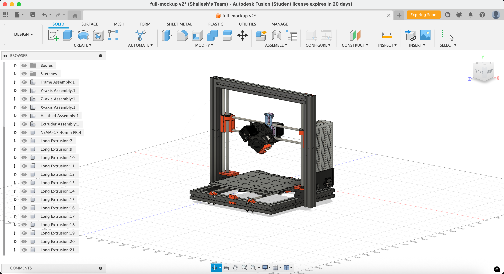

## 📌 project description

axon is a custom-designed 4-axis 3d printer inspired by the prusa i3 and bear upgrade designs. it features a 2040 aluminum extrusion frame, custom cad-modeled parts, and an additional axis for extended functionality and experimental motion control. the printer will be controlled by a btt octopus v1.1 mainboard running klipper firmware.

## 💡 why i made this project

i am building this printer to gain hands-on experience with cad, firmware, and 3d printer architecture. the goal is not only to assemble a machine but to understand and customize every component from the ground up.

## full mockup

